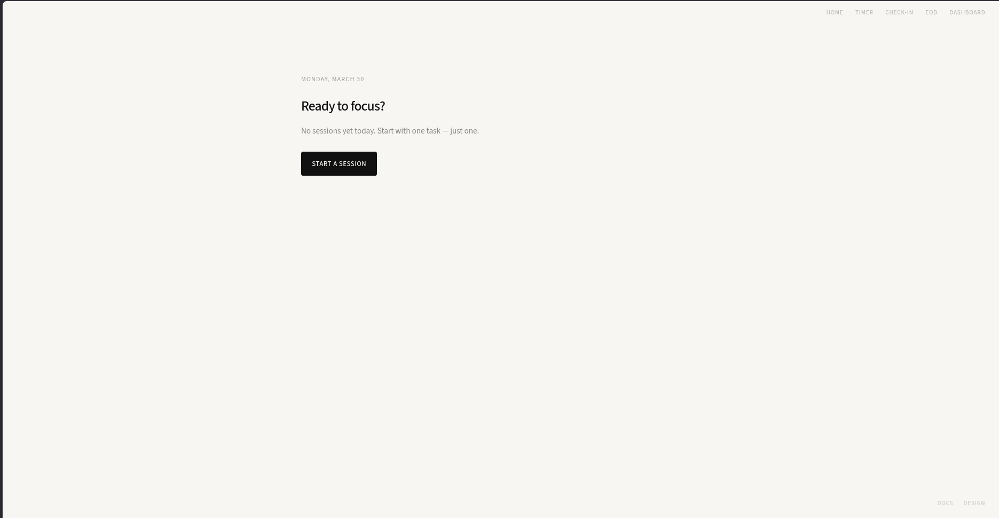
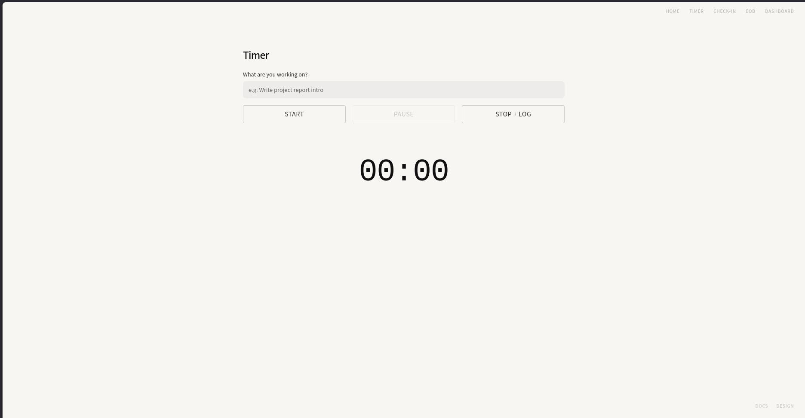
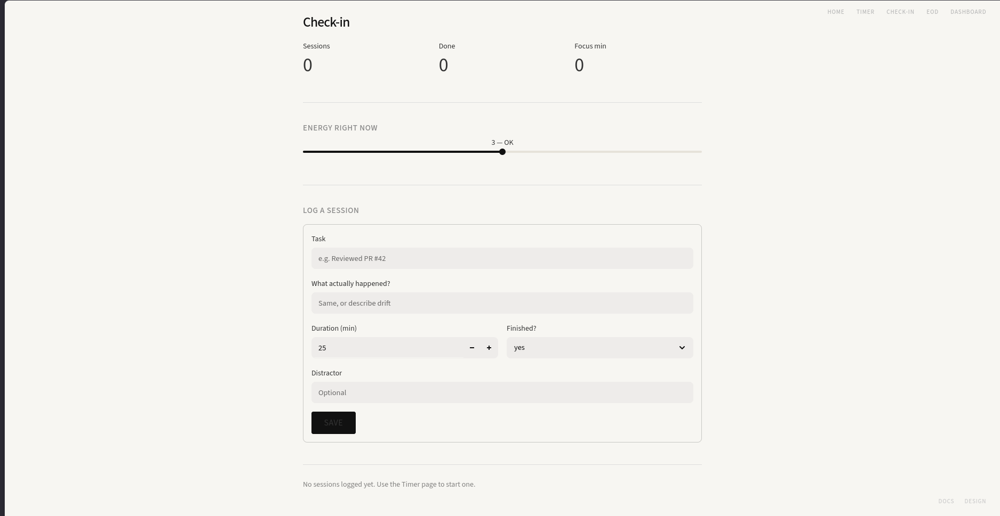
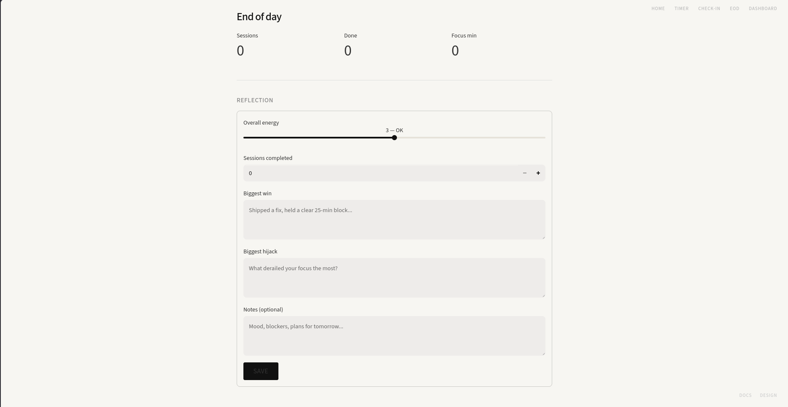
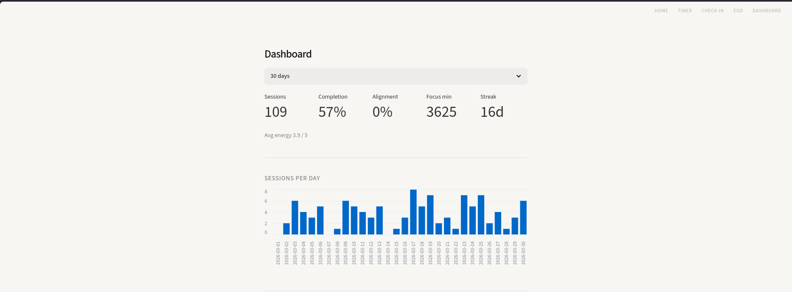
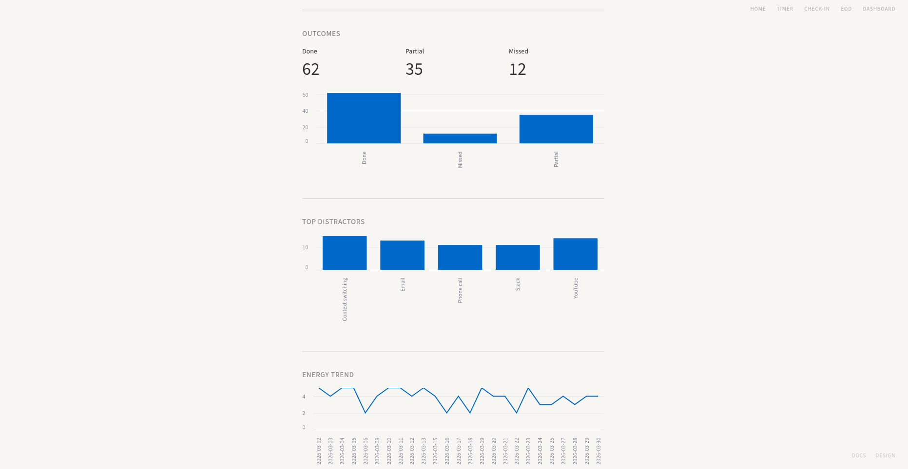
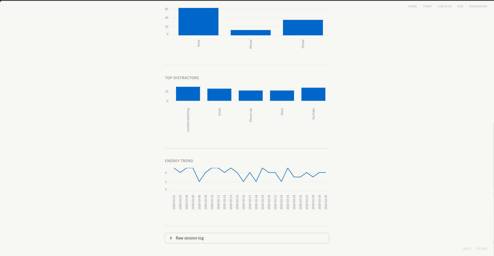

# Focus App

A local-first Streamlit app for ADHD-friendly focus tracking:
- Start a timed session quickly.
- Log what you intended vs what actually happened.
- Reflect at end of day.
- See trends (completion, alignment, streaks, distractors, energy).

## Features

- `Home` with context-aware CTA (start session, log EOD, or view dashboard).
- `Timer` page with start/pause/stop flow and post-session logging.
- `Check-in` page for quick manual logging and today's summary.
- `End of day` page with reflective prompts and upsert-by-date behavior.
- `Dashboard` page for 7/14/30/90-day analytics and charts.
- Local SQLite database (`focus.db`), no accounts, no cloud sync.

## Tech Stack

- Python
- Streamlit
- SQLite (`sqlite3` from Python stdlib)
- Pandas (used for chart/dataframe rendering)

## Quick Start

```bash
git clone https://github.com/ananthakrishnagopal/focus-app.git
cd focus-app

python -m venv .venv
source .venv/bin/activate
pip install -r requirements.txt

streamlit run app.py
```

Then open the local URL shown by Streamlit (usually `http://localhost:8501`).

## Screenshots

### Home


### Timer


### Check-in


### End of day


### Dashboard




## Project Structure

```text
focus-app/
├── app.py                  # Home page (context-aware nudge)
├── assets/
│   └── screenshots/        # README images
├── pages/
│   ├── 1_timer.py          # Focus timer + post-session log
│   ├── 2_checkin.py        # Mid-day check-in + manual log
│   ├── 3_eod.py            # End-of-day reflection
│   ├── 4_dashboard.py      # Analytics dashboard
│   ├── 5_docs.py           # In-app docs
│   └── 6_design.py         # In-app architecture notes
├── utils/
│   ├── db.py               # SQLite schema + DB helpers
│   ├── analytics.py        # Pure-Python analytics logic
│   └── style.py            # Shared styling + nav/footer helpers
├── requirements.txt
└── focus.db                # Auto-created local database
```

## Data Model

The app creates `focus.db` automatically with two tables:

- `sessions`
  - `date`, `task_declared`, `task_actual`, `duration_min`, `finished` (`yes|partial|no`), `distractor`, `start_time`
- `eod_logs`
  - one row per day (`date` is unique), with `energy`, `sessions_done`, `biggest_win`, `biggest_hijack`, `notes`

## Notes

- Your data is local to this project folder.
- Back up by copying `focus.db`.
- Reset data by deleting `focus.db` (schema is recreated on next launch).

## Screens/Flow

1. Start on `Home`.
2. Run a session in `Timer` and log outcome.
3. Use `Check-in` any time for manual entries.
4. Close your day in `End of day`.
5. Review patterns in `Dashboard`.

## Roadmap Ideas

- CSV export/import
- Reminder notifications
- Weekly summary view
- Optional cloud sync
